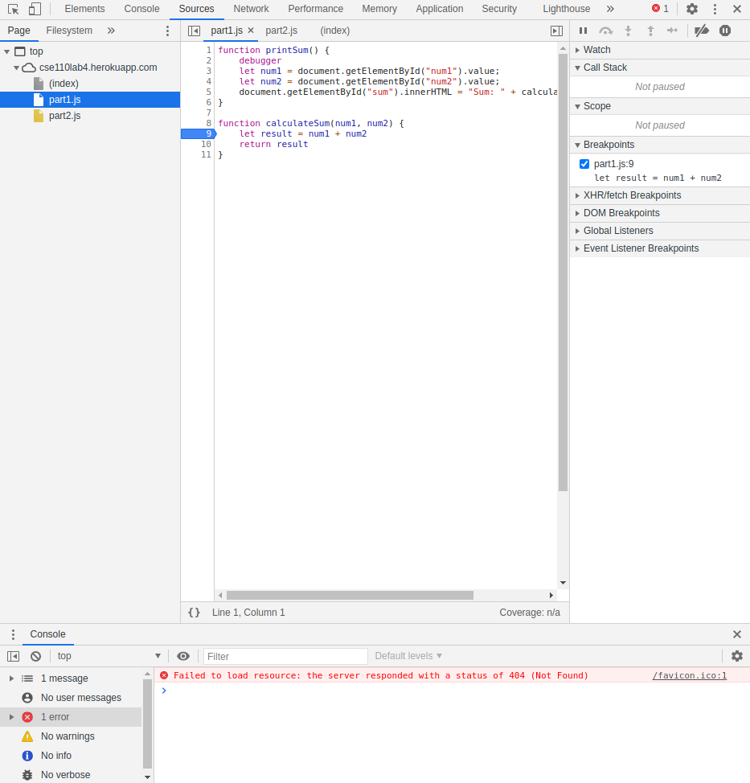
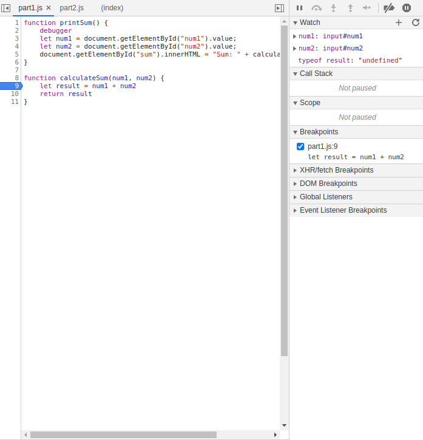
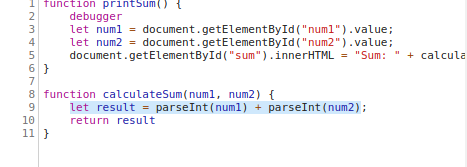

# Questions for https://cse110lab4.herokuapp.com/
screenshots:
breakpoints

watch expressions

1. result is being initalized by adding `num1` and `num2` with the `+` operator. But, `num1` and `num2` are both inputted as strings so the `+` operator concats them instead of adding them. 
2. To fix this, I can convert num1 and num2 from strings to numbers before adding like `let result = parseInt(num1) + parseInt(num2);`

screenshot of fix

# Networks Tab

1. citylots.json
2. part2.json
3. 1.0 kB (1002 B)
4. 79.36 ms
5. Mozilla/5.0 (X11; Linux x86_64) AppleWebKit/537.36 (KHTML, like Gecko) Chrome/87.0.4280.141 Safari/537.36
6. Apache
7. Tue, 26 Jan 2021 22:14:13 GMT
8. application/json
9. fetch('./citylots.json')